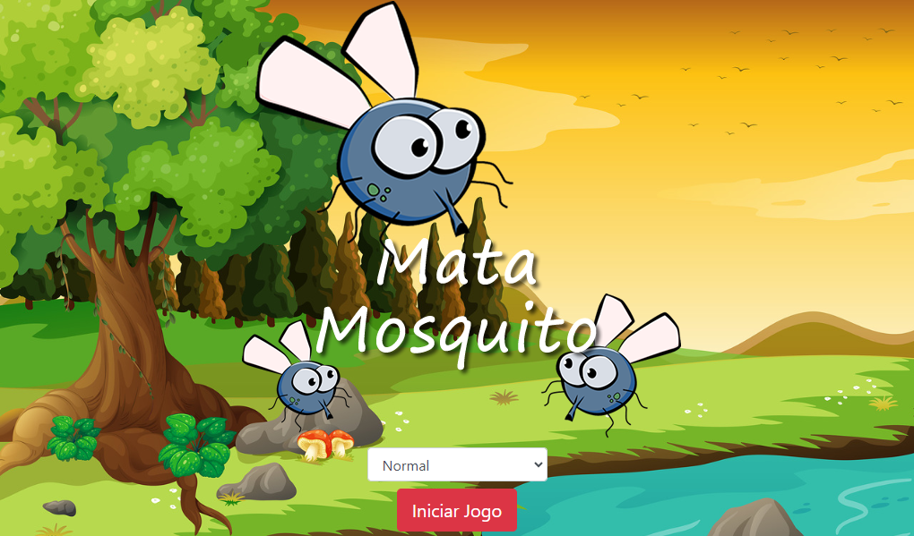

# MosquitoHuntGame
Bem-vindo ao MosquitoHuntGame, um jogo onde sua missão é eliminar mosquitos irritantes! Game web usando tecnologias web como HTML, CSS e JavaScript. 

## Visão Geral

O MosquitoHunt é um jogo que desafia os jogadores a espantar e eliminar mosquitos em vários níveis. Afie seus reflexos e teste sua precisão nesta aventura divertida de esmagamento de insetos.

## Recursos

- Ação rápida de esmagamento de mosquitos.
- Múltiplos níveis com dificuldade crescente.
- Placares de pontuação para acompanhar suas conquistas na caça aos mosquitos.

## Capturas de Tela

## Como Jogar

1. Baixe e instale o MosquitoHunt em seu dispositivo.
2. Inicie o jogo e escolha um nível.
3. Use seu mata-mosquito virtual para esmagar mosquitos e ganhar pontos.
4. Avance pelos níveis e supere sua pontuação máxima!

## Contribuição

1. Faça um fork do repositório.
2. Clone o fork para sua máquina local.
3. Faça suas modificações e adições.
4. Envie um pull request para revisão.

## Estrutura do Projeto

- `index.html`: Página principal que representa a home do jogo.
- `css/`: Diretório contendo arquivos CSS personalizados.
- `js/`: Diretório contendo arquivos JS personalizados.
- `img/`: Diretório para armazenar imagens.

## Agradecimentos

Obrigado por contribuir para o MosquitoHunt! Juntos, estamos criando uma experiência fantástica de caça a mosquitos. Sinta-se à vontade para relatar bugs, sugerir melhorias ou contribuir com código.

Boa caçada no MosquitoHunt!

